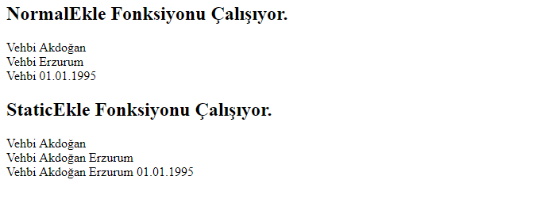

# Statik Method ve Statik Değişken Nedir?

Statik anahtar kelimesi kullanılan değişken, method veya sınıfın bir örneği (instance) oluşturulmadan o özelliğe ulaşılmasını sağlar. Yani new anahtar kelimesi ile bir örnek(instance) oluşturmaya gerek kalmadan o özelliği kullanabilmemizi sağlar. Statik methodlar belleğin farklı kısımlarında kaydedilirler.

## Statik Method ve Değişkenler
Statik method ve değişkenler bizim işimizi bir hayli kolaylaştırırlar. Mesela site ayarlarını tuttuğumuz bir  classımız olduğunu düşünün. Bu ayarları kullanmak istediğimiz her sayfada yeniden o sınıfı oluşturmak bizim performansımızı olumsuz yönde etkiler. Biz bu değerleri statik olarak tanımlarsak bellekte bir kere kaydolurlar ve isteğimiz sayfada da bir örnek oluşturmadan kullanabiliriz.

Statik bir değişken veya method oluştururken static anahtar kelimesini kullanırız.  Örneğin:

Statik Değişken Kullanımı:
```Php
static $a = 5;

static $a = 5;
```
Veya bir sınıf içinde method oluşturmak istersek:
```Php
class Deneme {
	public static $a = 5;
	public static function Test() {
		echo "Test Methodu Yazıdırıldı";
	}
	
}
// Çağırma Şekli
Deneme::Test(); // statik method çağırma şekli 
echo Deneme::$a; // statik değişken çağırma şekli
```
Üstteki örneğe bakacak olursak static anahtar kelimesi ile bir method ve değişken tanımladık. Sınıfın bitişinde de **SınıfAdı::MethodAdı, SınıfAdı::$DegiskenAdı** şeklinde statik methodu ve değişkeni  çağırdık.

Method veya değişken statik olmasaydı bu şekilde çağırdığımızda hata alacaktık.

## Statik Değişken ve Normal Değişkenin Farkı
Statik ve normal değişkenin normal kullanılırken farkı yoktur ama bir fonksiyon veya method içerisinde kullanılırken aralarında çok önemli bir fark vardır.

Bir fonksiyonun içerisinde bir statik değişken tanımlarsak bu değişken ramde bir kere oluşturulur ve değeri sürekli güncellenir. Normal değişkenler böyle değildir.

Yani kısaca statik bir değişkeni bir kere tanımlayıp sadece  değerini güncelliyoruz diyebiliriz.

  Statik ve normal olan iki fonksiyonu çalıştırıp aralarındaki farkı görürsek daha iyi anlaşılacaktır.

 ## Statik ve Normal Değişkenin Farkı
```php
function StaticEkle($b) {
	static $a = "Vehbi";
	$a.=" ".$b;
	
	echo "$a <br/>";
}
function NormalEkle($b) {
	$a = "Vehbi";
	$a.=" ".$b;
	
	echo "$a <br/>";
}

echo " <h2>NormalEkle Fonksiyonu Çalışıyor. </h2> ";
NormalEkle("Akdoğan");
NormalEkle("Erzurum");
NormalEkle("01.01.1995");


echo " <h2> StaticEkle Fonksiyonu Çalışıyor.</h2> ";
StaticEkle("Akdoğan");
StaticEkle("Erzurum");
StaticEkle("01.01.1995");
```
Kodu çalıştırdığımızda aşağıdaki gibi bir ekran görüntüsü alırız.




StaticEkle fonksiyonumuz her çalıştığında **static  $a=”Vehbi”;**  kodu çalışsada daha önceden **$a** adında bir statik değişken mevcut olduğu için değişkenin içeriği değiştirilmiyor.

Peki ne işimize yarayacak bu kod derseniz hemen güzel bir örnek yapalım.

Web sitesindeki başlığın Anabaşlık – Kategori – Alt Kategori – İçerik Şeklinde bir başlık oluşturan fonksiyon hazırlayalım.

Statik Değişken İle Title Generator Yapalım.
```php
function BaslikOlusturucu($b) {
	static $a = "Patika.dev";
	$a.=" - ".$b;
	
	echo "$a <br/>";
}

BaslikOlusturucu("PHP Eğitimleri"); // kategori sayfasında çalışan kod
BaslikOlusturucu("PHP OOP"); // alt kategori sayfasında çalışan kod
BaslikOlusturucu("Statik Method ve Değişkenler"); // içerik sayfasında çalışan kod
```
Fonksiyonu 3 kere çağırdık. Birinci fonksiyonu kategori.php sayfasında, ikinci fonksiyonu alt_kategori.php sayfasında, üçüncü fonksiyonu ise icerik.php sayfasında çalıştırırsak icerik.php ye erişen arkadaş 3 fonksiyonuda çalıştırıp aşağıdaki şekilde çıktı almış olur.
```
Patika.dev – PHP Eğitimleri – PHP OOP – Statik Method ve Değişkenler
```